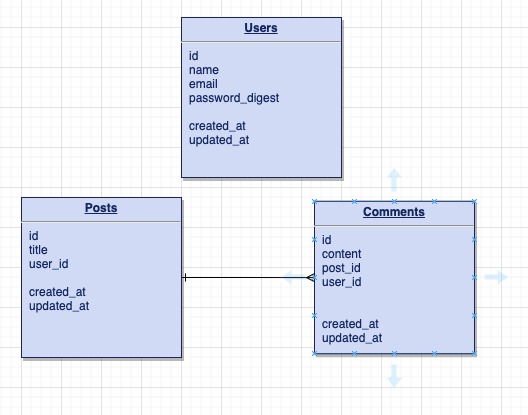

# Conspiracy Theories


[Github](https://github.com/michaeljgrieshaber/conspiracyTheories)

## Overview

Users can post their conspiracy theories and other users can add comments about the theories.

## MVP

1. Functional Code
2. User authentication
3. Responsiveness
4. Full CRUD
5. Ruby backend
6. React frontend
7. Deploy to netlify/heroku
8. Render info from database

### Goals

### Libraries & Dependencies

| Library      | Description                                           |
| ------------ | ----------------------------------------------------- |
| React        | Front end framework                                   |
| React Router | Front end navigation                                  |
| Axios        | Make requests to the server from front end            |
| Ruby         | Back end server                                       |
| Pry          | Testing                                               |
| Bcrypt       | User authentication                                   |
| JWT          | For cryptic login                                     |
| Cors         | Controlling what site can make requests to the server |

### Client (Front End)

[Wireframe](https://www.figma.com/file/V9sTReyTrfm39K95P4i8lb/P4-Blog?node-id=1%3A3)

[Compnent Tree](https://whimsical.com/conspiracy-theories-S9YsJEfJTjs53WcNf2kNhx)

Component Architecture

```
src
|__ Services/
      |__ apiConfig.js
|__ Components/
      |__ Layout
          |__ layout.css
          |__ layout.jsx
      |__ MainContainer.jsx
      |__ Logout.jsx
|__ Screens/
      |__ Landing
          |__ landing.jsx
          |__ landing.css
      |__ Listing
          |__ listing.jsx
          |__ listing.css
      |__ Register
          |__ register.jsx
          |__ register.css
      |__ Login
          |__ login.jsx
          |__ login.css    
      |__ TheoryView
          |__ TheoryView.jsx
          |__ TheoryView.css
      |__ CreateTheory
          |__ createTheory.jsx
          |__ CreateTheory.css    

```

Time Estimtates
| Day | Deliverable | Status |
| --------- | --------------------------- | ---------- |
| 11/01/21 | Work on README/pitch | complete |
| 11/02/21 | Get approved, Code backend | incomplete |
| 11/03/21 | Code backend, Code frontend | incomplete |
| 11/04/21 | Code frontend | incomplete |
| 11/05/21 | Code frontend/CSS | incomplete |
| 11/06/21 | CSS | incomplete |
| 11/07/21 | CSS | incomplete |
| 11/08/21 | Present | incomplete |
| 11/08/21+ | Post MVP | incomplete |

| Component            | Priority | Estimated Time | Time Invested |
| -------------------- | :------: | :------------: | :-----------: |
| Setting up back end  |    H     |      3hrs      |       ?       |
| Models               |    M     |      3hrs      |       ?       |
| User Authentication  |    H     |      6hrs      |       ?       |
| Routes/Controller    |    H     |      6hrs      |       ?       |
| Setting up front end |    H     |      3hrs      |       ?       |
| Screens & routes     |    H     |      3hrs      |       ?       |
| Forms                |    H     |      6hrs      |       ?       |
| Axios calls          |    H     |      3hrs      |       ?       |
| Display logic        |    L     |      3hrs      |       ?       |
| CSS                  |    L     |      6hrs      |       ?       |
| Total                |    H     |     42hrs      |       ?       |

### Server (Backend)



## Post MVP

1. Attach users to comments
2. Add a counter to each theory so the listing page shows how many comments it has


## Code Showcase

```

```

## Code Issues & Resolutions

```

```